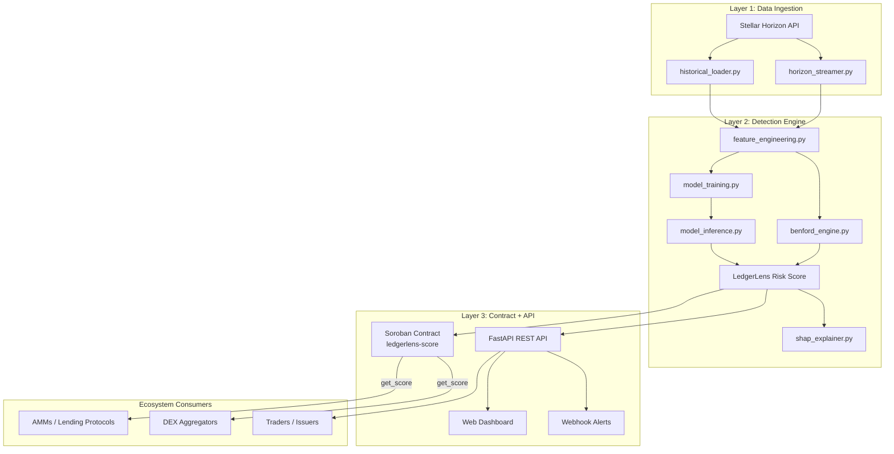

# LedgerLens 🔍

[](https://stellar.org)
[](https://soroban.stellar.org)
[](LICENSE)


Hybrid on-chain fraud detection for the Stellar DEX — detecting wash trading and artificial volume using Benford's Law combined with ensemble machine learning, with risk scores anchored on Soroban.

## Overview

LedgerLens is a fraud detection system for the Stellar Decentralised Exchange (SDEX). It ingests trade data from the Stellar Horizon API, scores wallets and asset pairs for wash-trading risk using a combination of Benford's Law digit-distribution analysis and ensemble ML classifiers, and publishes those scores both via a public REST API and an on-chain Soroban contract so other protocols can consume them natively.

### The Problem

Wash trading — simultaneously buying and selling the same asset to artificially inflate trading volume — is one of the most pervasive forms of market manipulation in DeFi. Blockchain transparency means every transaction is recorded, but the sheer volume of on-chain activity makes manual detection impossible.

On DEXs, wash trading causes real harm:

- **Traders are misled** into believing an asset has genuine liquidity and market interest when it does not
- **Token issuers manipulate rankings** on DEX aggregators and data platforms by inflating 24-hour volume figures
- **Liquidity providers lose funds** by entering pools that appear active but are dominated by self-dealing activity
- **Ecosystem credibility suffers** — inflated volume metrics on the Stellar DEX undermine confidence from institutional participants, exchanges, and new users

Existing detection approaches are either manual (slow and unscalable) or rely on simple heuristics (easily gamed). No production-grade, open-source wash trading detection system exists for the Stellar DEX — LedgerLens is built to fill that gap.

### What LedgerLens Does

At a high level, it does three things:

- **🔍 Detects** — identifies wallet pairs, trading clusters, and asset pools exhibiting statistically anomalous transaction patterns consistent with wash trading, including circular trade routing, self-matching order behaviour, and artificial volume concentration
- **📊 Scores** — assigns each wallet and each trading pair a **LedgerLens Risk Score (0–100)** based on the combined output of its Benford anomaly metrics and ML classifiers, updating continuously as new ledger data is processed
- **📡 Reports** — exposes risk scores and flagged activity through a public API and lightweight dashboard, making the intelligence accessible to DEX users, protocol teams, wallet providers, and compliance integrators without requiring technical expertise

## Features

- **Benford's Law Anomaly Engine**: Chi-square, per-digit Z-score, and MAD analysis of transaction amounts across rolling time windows (1h, 4h, 24h, 7d, 30d)
- **Ensemble ML Scoring**: Random Forest, XGBoost, and LightGBM classifiers trained on labelled wash-trade patterns with SHAP interpretability
- **LedgerLens Risk Score (0–100)**: Continuously updated composite score per wallet and per trading pair
- **On-Chain Risk Registry**: Soroban smart contract exposes risk scores so AMMs, lending protocols, and aggregators can gate suspicious activity natively
- **Public REST API**: Query scores, recent alerts, and asset risk rankings
- **Lightweight Dashboard**: Web UI for risk-score visibility without requiring technical expertise
- **Open Methodology**: Scores, features, and training data are fully transparent and auditable

## Architecture



### Core Components

- **ingestion/horizon_streamer.py**: Real-time trade data from the Horizon API (SSE / per-ledger polling)
- **ingestion/historical_loader.py**: Bulk historical trade ingestion
- **ingestion/operations_loader.py**: Order-book event ingestion (offer create/update/cancel) from Horizon operations
- **ingestion/account_loader.py**: Account funding-source and creation-time metadata for wallet-graph features
- **ingestion/data_models.py**: Pydantic schemas for trade, asset, and order-book records
- **detection/benford_engine.py**: Benford's Law feature computation (chi-square, Z-score, MAD)
- **detection/feature_engineering.py**: On-chain ML feature extraction
- **detection/risk_score.py**: Shared `RiskScore` schema and Benford+ML score blending
- **detection/model_training.py**: Trains the Random Forest / XGBoost / LightGBM ensemble
- **detection/model_inference.py**: Real-time risk scoring
- **detection/shap_explainer.py**: SHAP-based interpretability layer

The Soroban contract, REST API, and dashboard live in the
`ledgerlens-contracts`, `ledgerlens-api`, and `ledgerlens-dashboard` repos
respectively — see [LedgerLens Organization](#ledgerlens-organization).

## Benford's Law on the Blockchain

Benford's Law predicts that the leading digit of naturally occurring transaction amounts follows a known, non-uniform distribution (digit 1 ≈ 30.1%, digit 9 ≈ 4.6%). Wash-trading bots tend to use fixed lot sizes or round/algorithmic amounts, producing distributions that diverge from this expectation.

| Metric | What it measures |
|---|---|
| **Chi-square statistic** | Whether the overall digit distribution deviates significantly from Benford's expected distribution |
| **Z-score (per digit)** | Whether any individual digit (1–9) appears with significantly higher or lower frequency than expected |
| **Mean Absolute Deviation (MAD)** | Composite divergence measure; values above 0.015 indicate non-conformity |

Benford signals alone are insufficient (legitimate market makers can also be non-Benford), so they are combined with the ML layer below.

## Machine Learning Layer

### Feature groups (26 features, see `detection/feature_engineering.FEATURE_NAMES`)

- **Benford features (15)**: Chi-square, Z-score, and MAD across 5 rolling windows (1h, 4h, 24h, 7d, 30d)
- **Trade pattern features (4)**: counterparty concentration ratio, round-trip trade frequency, self-matching rate, order cancellation rate
- **Volume and timing features (4)**: volume-to-unique-counterparty ratio, intra-minute clustering, off-hours activity ratio, volume spike frequency
- **Wallet graph features (3)**: funding source similarity, network centrality within the trading graph, account age at time of activity

### Models

| Model | Role |
|---|---|
| **Random Forest** | Stable baseline; handles missing features gracefully |
| **XGBoost** | Primary classifier; strongest performance on tabular on-chain data |
| **LightGBM** | High-speed inference for real-time scoring |

Models are trained with **SMOTE** for class imbalance and evaluated with **AUC-ROC**, **Precision-Recall AUC**, and **F1-score**. SHAP values provide per-score interpretability.

## Soroban Smart Contract Layer

The Soroban contract is the on-chain truth layer for LedgerLens risk scores.

### Contract Functions

- `submit_score(wallet: Address, asset_pair: Symbol, score: u32, timestamp: u64)` - Registers a computed risk score on-chain (authorised LedgerLens service account only)
- `get_score(wallet: Address, asset_pair: Symbol) -> RiskScore` - Read-only; returns the most recent risk score and timestamp for a wallet/asset pair, callable by any other Soroban contract

```rust
// Simplified Soroban interface (Rust pseudocode)
pub struct RiskScore {
    pub score: u32,          // 0–100; higher = more suspicious
    pub benford_flag: bool,  // True if Benford anomaly detected
    pub ml_flag: bool,       // True if ML classifier flagged
    pub timestamp: u64,      // Ledger timestamp of last update
    pub confidence: u32,     // Model confidence 0–100
}
```

This composability lets AMMs, lending protocols, and DEX aggregators on Stellar query LedgerLens scores natively — for example, gating liquidity provision from wallets above a configurable risk threshold — without an external oracle.

### Soroban Integration (`detection/soroban_publisher.py`)

After each pipeline run, all `RiskScore` records above `RISK_SCORE_THRESHOLD` are submitted on-chain via `SorobanPublisher.submit_batch()`. This transforms LedgerLens from a standalone detection tool into composable on-chain financial infrastructure.

**Configuration** (see `.env.example` for defaults):

| Variable | Purpose |
|---|---|
| `LEDGERLENS_SCORE_CONTRACT_ID` | Soroban contract ID of the deployed `ledgerlens-score` contract |
| `LEDGERLENS_SERVICE_SECRET_KEY` | **Secret**: Stellar account key authorized to call `submit_score()` on the contract |
| `SOROBAN_RPC_URL` | Soroban RPC endpoint (separate from Horizon; defaults to Testnet) |
| `NETWORK_PASSPHRASE` | Stellar network passphrase (must match the network the contract is on) |
| `SOROBAN_CIRCUIT_BREAKER_THRESHOLD` | Consecutive failures before the circuit opens (default: 5) |
| `SOROBAN_CIRCUIT_RESET_SECONDS` | Seconds until the circuit resets (default: 300) |

**Transaction lifecycle**:

1. **Build** — create an `InvokeContractFunction` operation for `submit_score(wallet, asset_pair, score, timestamp)`
2. **Simulate** — call `simulate_transaction` to obtain the resource fee
3. **Sign** — sign with the service account keypair (in-process; the key never leaves the machine)
4. **Submit** — `send_transaction` with the signed transaction
5. **Poll** — `get_transaction` every 1 second until `SUCCESS` or `FAILED`

**Error handling & retry logic**:

- `tx_bad_seq` — refresh the account sequence number and retry once
- `INSUFFICIENT_FEE` — multiply the fee by 1.5 and retry once
- Soroban `auth_failed` — log `ERROR` and raise `SorobanSubmissionError` immediately (do not retry — the service key is misconfigured)
- All other errors — log `WARNING`, record the failure, and include the error in the `submit_batch` results dict

**Circuit breaker**: after `SOROBAN_CIRCUIT_BREAKER_THRESHOLD` consecutive failures within a 60-second rolling window, the publisher stops calling the contract and raises `SorobanCircuitOpenError`. The circuit auto-resets after `SOROBAN_CIRCUIT_RESET_SECONDS`. This prevents submission storms on contract failures without blocking the pipeline.

**Security**:
- `LEDGERLENS_SERVICE_SECRET_KEY` is converted to a `Keypair` at construction time; the raw key string is not retained as an instance variable
- The keypair object's secret is never included in `__repr__`, logs, or the `on_chain_submissions` audit table
- The publisher overrides `__getstate__` to exclude the keypair from pickle serialization
- Running with `--no-submit` (via `cli.py score --no-submit`) skips all on-chain calls

**Audit log**: every submission attempt (success, failure, or skip) is written to the `on_chain_submissions` table in the local SQLite store. The table records wallet, asset pair, score, transaction hash (if available), status, error message, and timestamp.

## Repository Structure

This repository (`ledgerlens-core`) contains only the detection engine. The
API, dashboard, and Soroban contract live in separate repos — see
[LedgerLens Organization](#ledgerlens-organization) below.

```
ledgerlens-core/
│
├── README.md                         ← This file
├── requirements.txt                  ← Python dependencies
├── pyproject.toml                    ← Project metadata, pytest config
├── .env.example                      ← Configuration template (incl. cross-repo keys)
├── run_pipeline.py                   ← Full detection pipeline entry point
├── cli.py                            ← `ledgerlens` CLI (generate-data, train, score, serve)
├── Dockerfile / docker-compose.yml   ← Containerized local API
│
├── config/
│   └── settings.py                   ← Environment-driven configuration
│
├── ingestion/
│   ├── horizon_streamer.py           ← Real-time trade data from Horizon API
│   ├── historical_loader.py          ← Bulk historical trade ingestion
│   ├── operations_loader.py          ← Order-book event ingestion (offer ops)
│   ├── account_loader.py             ← Account funding-source / creation-time metadata
│   ├── synthetic_data.py             ← Synthetic trade/wash-ring generator for local training
│   ├── http_client.py                ← Retrying HTTP helper for Horizon calls
│   └── data_models.py                ← Pydantic schemas for trade/asset/order-book records
│
├── detection/
│   ├── benford_engine.py             ← Benford's Law feature computation
│   ├── feature_engineering.py        ← On-chain ML feature extraction
│   ├── dataset.py                    ← Labelled feature dataset builder (training)
│   ├── model_training.py             ← Train ensemble classifiers
│   ├── model_inference.py            ← Real-time risk scoring
│   ├── shap_explainer.py             ← SHAP interpretability layer
│   ├── risk_score.py                 ← Shared `RiskScore` schema + scoring logic
│   └── storage.py                    ← SQLite-backed local RiskScore store
│
├── api/
│   └── main.py                       ← Local read-only FastAPI app serving RiskScores
│
└── tests/
    └── ...
```

## Quick Start

### 1. Install dependencies

```bash
pip install -r requirements.txt
```

### 2. Configure environment

```bash
cp .env.example .env
```

Fill in the Horizon, model, and cross-repo settings described in
[LedgerLens Organization](#ledgerlens-organization).

### 3. Train on synthetic data

No labelled dataset from `ledgerlens-data` is required to get started —
`cli.py train` generates a synthetic trade history with labelled
wash-trading rings (`ingestion/synthetic_data.py`) and trains the
RF/XGBoost/LightGBM ensemble on it:

```bash
python cli.py train
```

### 4. Run the detection pipeline

```bash
python run_pipeline.py
```

This scores each wallet/asset-pair combination and writes the resulting
`RiskScore` records to the local SQLite store (`LEDGERLENS_DB_PATH`).

### 5. Serve the local API

```bash
python cli.py serve --reload
```

Exposes `/health`, `/scores`, `/scores/{wallet}`, `/alerts`, and
`/assets/risk-ranking` over the locally stored `RiskScore` records — a
stand-in for `ledgerlens-api` during local development.

#### CORS configuration

The local API defaults to **deny-all** CORS (no browser origins are allowed
unless explicitly configured). Set `LEDGERLENS_CORS_ALLOWED_ORIGINS` in your
`.env` to a comma-separated list of permitted origins:

```bash
# Allow the dashboard dev server
LEDGERLENS_CORS_ALLOWED_ORIGINS=http://localhost:3000

# Allow multiple origins (e.g. staging + production dashboard)
LEDGERLENS_CORS_ALLOWED_ORIGINS=https://dashboard.ledgerlens.io,https://staging.ledgerlens.io
```

> **Security**: never set `LEDGERLENS_CORS_ALLOWED_ORIGINS=*`. The API rejects
> a wildcard at startup with a `ValueError`. Combining `allow_origins=["*"]`
> with `allow_credentials=True` would let any website read authenticated
> responses — a well-known OWASP A05:2021 misconfiguration. The setting enforces
> an explicit origin list to prevent this from ever reaching production.

#### `/health` response contract

`GET /health` performs two real checks on every call:

| Component | Check | OK value |
|---|---|---|
| `db` | Executes `SELECT 1` via the existing SQLite connection | `"ok"` |
| `models` | Each model `.joblib` file exists under `MODEL_DIR` and has size > 0 | `"ok"` |

Returns **HTTP 200** when both pass:

```json
{"status": "ok", "db": "ok", "models": "ok"}
```

Returns **HTTP 503** when any check fails, naming the failing component:

```json
{"status": "degraded", "db": "error: database unreachable", "models": "ok"}
{"status": "degraded", "db": "ok", "models": "missing: random_forest, xgboost"}
```

The response body never contains raw filesystem paths or exception text —
errors are logged server-side at `ERROR` level via `logger.exception`.

> The production API, dashboard, and Soroban contract live in their
> respective repos (`ledgerlens-api`, `ledgerlens-dashboard`,
> `ledgerlens-contracts`).

### Docker

```bash
docker compose up --build
```

## CLI Reference

```bash
python cli.py generate-data   # write synthetic trades/labels to CSV
python cli.py train           # train the ensemble on synthetic data
python cli.py score           # run the pipeline against live Horizon data
python cli.py stream          # stream trades from Horizon SSE and score in rolling batches
python cli.py retrain-check   # check for distribution drift and retrain if needed
python cli.py serve           # serve the local API
python cli.py webhook-worker  # run the webhook delivery worker
python cli.py db-migrate      # apply any pending SQLite schema migrations
```

## Continuous Retraining

LedgerLens models are trained once on synthetic data, but in production, wash-trading strategies evolve — bots adapt their lot sizes, timing patterns, and circular routing to evade detection. Without detecting and responding to this **concept drift**, model performance silently degrades over time.

The continuous retraining pipeline automatically monitors the distribution of features in production scoring and triggers retraining when drift is detected, with safe rollback to the previous model if the new model underperforms.

### Drift Detection Methodology

Drift is detected using the **Population Stability Index (PSI)**, a statistical measure of how much a feature distribution has shifted between training and production:

$$\text{PSI} = \sum_{i=1}^{n} \left( \text{current}_i - \text{training}_i \right) \times \ln\left(\frac{\text{current}_i}{\text{training}_i}\right)$$

**PSI Interpretation:**
- **PSI = 0**: Distributions are identical
- **0 < PSI < 0.10**: Negligible drift; no action needed
- **0.10 ≤ PSI < 0.20**: Small drift; monitor closely
- **PSI ≥ 0.20**: Significant drift; retraining recommended
- **PSI > 0.25**: Severe drift; retraining strongly advised

Drift is declared when **at least 3 features** exceed PSI threshold (default 0.20). This threshold minimizes false positives from natural market dynamics while capturing genuine performance-degrading drift.

### Running Drift Checks

After the pipeline records scored features (automatic on each `python cli.py score` run), trigger a drift check and potential retrain:

```bash
python cli.py retrain-check
```

**Options:**
- `--psi-threshold 0.20`: PSI threshold for marking a feature as drifted (default 0.20)
- `--min-drifted-features 3`: Minimum number of drifted features to trigger retraining (default 3)
- `--force-retrain`: Force retraining even if no drift detected (useful for manual updates)

**What happens:**
1. Computes PSI for all features, comparing production data (last 30 days) against training reference
2. If drift detected (or force-retrain enabled), trains a new ensemble on the original training distribution (synthetic data)
3. Compares new models' AUC-ROC scores against previous models
4. **Promotes** new models only if AUC-ROC ≥ previous version (safer rollout)
5. **Reverts** to previous version if new models underperform
6. Writes a drift report to `./drift_reports/YYYYMMDD_HHMM.json` with PSI values and promotion decision

### Model Versioning and Rollback

Each trained model is stored with a version hash (SHA-256[:8] of training data fingerprint + timestamp):

```
models/
├── random_forest_v12a3b4c5.joblib      # Versioned model
├── random_forest_latest.txt              # Points to current version
├── xgboost_v12a3b4c5.joblib
├── xgboost_latest.txt
├── lightgbm_v12a3b4c5.joblib
├── lightgbm_latest.txt
├── training_reference.csv                # Reference dataset for drift detection
└── training_metadata.json                # Training metadata, AUC-ROC scores, etc.
```

If a newly promoted model degrades performance, rollback is automatic:

```bash
# Manual rollback (if needed):
# Edit random_forest_latest.txt, xgboost_latest.txt, lightgbm_latest.txt
# to point to a previous version (e.g., 12a3b4c5)
```

### Feature Distribution Tracking

Every time the scoring pipeline runs, feature vectors are persisted to SQLite for drift monitoring:

```sql
CREATE TABLE feature_distribution_snapshots (
    id INTEGER PRIMARY KEY,
    wallet TEXT,
    asset_pair TEXT,
    feature_name TEXT,
    feature_value REAL,
    recorded_at TIMESTAMP
);
```

**Storage budget**: At 1,000 wallets/run × 4 runs/day × 30 days × 26 features × ~8 bytes/float ≈ 25 MB. Hard cap: **500,000 rows**; oldest rows are pruned to 450,000 when exceeded.

### Scheduling Retrain Checks

For production deployments, schedule retrain checks via cron or systemd timer:

**Cron example (daily at 2 AM):**
```cron
0 2 * * * cd /path/to/ledgerlens-core && python cli.py retrain-check >> /var/log/ledgerlens-retrain.log 2>&1
```

**Systemd timer example:**

`/etc/systemd/system/ledgerlens-retrain.service`
```ini
[Unit]
Description=LedgerLens Continuous Retrain Check
After=network.target

[Service]
Type=oneshot
WorkingDirectory=/path/to/ledgerlens-core
ExecStart=/usr/bin/python cli.py retrain-check
StandardOutput=journal
StandardError=journal
```

`/etc/systemd/system/ledgerlens-retrain.timer`
```ini
[Unit]
Description=Daily LedgerLens Retrain Check

[Timer]
OnCalendar=daily
OnCalendar=*-*-* 02:00:00
Persistent=true

[Install]
WantedBy=timers.target
```

Enable and start:
```bash
systemctl enable ledgerlens-retrain.timer
systemctl start ledgerlens-retrain.timer
```

### Monitoring and Alerts

Inspect drift reports to monitor model stability:

```bash
ls -lh ./drift_reports/
# Example output:
# 20240615_0200.json: {"drift_detected": true, "promoted": true, ...}
# 20240614_0200.json: {"drift_detected": false, "promoted": false, ...}
```

**Alert on failures**: If `promoted: false` but `drift_detected: true`, the new models failed to outperform the current ones. Investigate feature shifts in the drift report's `psi_report` field and consider:

- Expanding the training dataset with recent adversarial examples
- Adjusting feature engineering (e.g., new adversarial or graph features)
- Lowering the PSI threshold if the drift is natural (market regime change) rather than evasion

### Model Observability API

Every `cli.py retrain-check` run also persists its drift report and per-model retrain outcome to SQLite, queryable over HTTP instead of grepping `./drift_reports/`:

| Method | Endpoint                | Description                                  |
|--------|--------------------------|-----------------------------------------------|
| `GET`  | `/admin/drift-reports`   | Most recent drift checks (PSI report, threshold, detected flag) |
| `GET`  | `/admin/retrain-runs`    | Most recent per-model retrain outcomes (old/new version, AUC-ROC, promoted, forced); filter with `?model_name=` |

Both endpoints require an admin key, since they expose internal model governance data. Set `LEDGERLENS_ADMIN_API_KEY` and pass it via the `X-LedgerLens-Admin-Key` header:

```bash
export LEDGERLENS_ADMIN_API_KEY="$(openssl rand -hex 32)"
curl -H "X-LedgerLens-Admin-Key: $LEDGERLENS_ADMIN_API_KEY" http://localhost:8000/admin/retrain-runs?model_name=random_forest
```

If `LEDGERLENS_ADMIN_API_KEY` is unset, both endpoints return `503` rather than allowing unauthenticated access.

## Webhook Alerts

LedgerLens can push risk-score alerts to subscriber URLs via webhooks.
When the detection pipeline (`run_pipeline.py`) produces scores above a
subscriber's threshold, a signed payload is POSTed to their endpoint.

### Subscriber Registration

Register a webhook subscriber via the API:

```bash
curl -X POST http://localhost:8000/webhooks \
  -H "Content-Type: application/json" \
  -d '{
    "url": "https://my-protocol.xyz/webhook",
    "secret": "whsec_your_hmac_secret",
    "min_score": 70
  }'
```

Optional filters restrict alerts by wallet or asset pair:

```json
{
  "url": "https://my-protocol.xyz/webhook",
  "secret": "whsec_your_hmac_secret",
  "min_score": 80,
  "wallet_filter": "GABC123,GDEF456",
  "asset_pair_filter": "XLM/USDC"
}
```

The response returns a `subscriber_id` (UUID) used for management.

### Management Endpoints

| Method | Path | Description |
|--------|------|-------------|
| `POST`   | `/webhooks`                  | Register a subscriber        |
| `GET`    | `/webhooks`                  | List active subscribers      |
| `DELETE` | `/webhooks/{subscriber_id}`  | Deactivate a subscriber      |
| `GET`    | `/webhooks/dead-letters`     | List permanently failed deliveries |

### Payload Format

Every webhook POST carries this JSON body:

```json
{
  "event": "risk_score_alert",
  "data": {
    "wallet": "GABCDEF123...",
    "asset_pair": "XLM/USDC",
    "score": 85,
    "benford_flag": true,
    "ml_flag": true,
    "confidence": 90,
    "timestamp": "2026-06-16T12:00:00Z"
  },
  "timestamp": "2026-06-16T12:00:05Z"
}
```

### HMAC Verification

Each request includes a `X-LedgerLens-Signature` header:

```
X-LedgerLens-Signature: sha256=<hex-digest>
```

The digest is an HMAC-SHA256 of the raw request body using the
subscriber's `secret`. Receivers **must** verify this signature before
trusting the payload. Example verification in Python:

```python
import hmac, hashlib

def verify_ledgerlens_webhook(body: bytes, secret: str, signature: str) -> bool:
    expected = "sha256=" + hmac.new(
        secret.encode(), body, hashlib.sha256
    ).hexdigest()
    return hmac.compare_digest(signature, expected)
```

The `X-LedgerLens-Timestamp` header contains the Unix epoch second when
the delivery was attempted. Receivers SHOULD reject timestamps older than
5 minutes to prevent replay attacks.

### Delivery Guarantees

- **At-least-once delivery**: unacknowledged items stay `pending` in the
  queue and are retried on worker restart.
- **Exponential backoff**: attempt N is retried at `now + 2^N × 5s`
  (capped at 1 hour).
- **Dead-letter queue**: after 8 consecutive failures the item moves to
  `dead` status. Inspect via `GET /webhooks/dead-letters`.
- **Concurrency limit**: at most 10 deliveries run in parallel; slow
  subscribers do not block others.

### Running the Delivery Worker

```bash
python cli.py webhook-worker --interval 5
```

This polls the delivery queue every 5 seconds and delivers due webhooks.
Run as a long-lived foreground process (e.g., under systemd or supervisor).

### Security Notes

- Subscriber URLs must use `https://`. HTTP URLs and private/reserved IPs
  are rejected at registration (SSRF protection).
- HMAC secrets are encrypted at rest with AES-256-GCM. The encryption key
  is loaded from `LEDGERLENS_WEBHOOK_ENCRYPTION_KEY` (32-byte base64,
  stored in the environment **only**).
- Raw secrets never appear in API responses, logs, or error messages.
- The response body from the webhook receiver is discarded entirely to
  prevent log injection.

## Testing

```bash
pytest
```

Covers:
- ✅ Benford's Law feature computation
- ✅ ML feature engineering (trade pattern, volume/timing features)
- ✅ Synthetic data generation and labelled dataset building
- ✅ RiskScore combination logic and SQLite storage
- ✅ Local API and CLI
- ✅ Horizon HTTP retry/backoff behaviour

## Roadmap

### Phase 1 — Foundation *(Months 1–2)*
- [x] Stellar Horizon API ingestion pipeline (historical + streaming)
- [x] Benford's Law engine for on-chain transaction amounts
- [x] Initial feature engineering from SDEX trade data
- [x] Baseline ML model training on synthetic wash trade patterns
- [ ] Internal testing on Stellar Testnet

### Phase 2 — Core Product *(Months 3–4)*
- [x] Full ensemble model training and evaluation
- [x] SHAP interpretability integration
- [ ] Soroban smart contract deployment on Testnet
- [x] Local REST API (v1, read-only) — see `api/main.py`
- [ ] Public REST API with rate limiting (`ledgerlens-api`)
- [ ] Web dashboard (beta)

### Phase 3 — Ecosystem Integration *(Months 5–6)*
- [ ] Mainnet deployment
- [ ] SDK for protocol integrations (Python + JavaScript)
- [ ] Webhook alert system for asset issuers and protocol teams
- [ ] Open dataset release: labelled SDEX wash trade patterns
- [ ] Community feedback and model refinement cycle

### Phase 4 — Scale *(Post-Grant)*
- [ ] Continuous model retraining pipeline
- [ ] Coverage expansion to AMM pools and cross-asset paths
- [ ] Integration partnerships with Stellar DEX aggregators
- [ ] Developer documentation portal

## Why This Matters for the Stellar Ecosystem

A DEX where volume figures can't be trusted is one that institutional participants and serious traders avoid. LedgerLens addresses this directly:

- **For traders** — Risk scores show which assets have genuine liquidity, without requiring on-chain expertise
- **For asset issuers** — A low risk score is a credibility signal for listings and investor materials
- **For protocol teams** — Integrate LedgerLens scores into AMM/lending contract logic to protect users from wash-traded assets
- **For the Stellar Foundation and ecosystem** — An open, verifiable, community-maintained fraud detection layer strengthens Stellar's case as trustworthy financial infrastructure

LedgerLens is an **open-source public good** — methodology, scores, and training data are transparent and auditable, and the project will always be free to query.

## Dependencies

- Python 3.10+ (`requirements.txt`)
- `soroban-sdk` — for the on-chain risk registry contract
- FastAPI, scikit-learn, XGBoost, LightGBM, SHAP

## License

MIT

## Contributing

LedgerLens is being developed as an open-source contribution to the Stellar ecosystem, submitted as part of the **Drip Wave builder programme**. We are actively looking for collaborators with experience in:

- Stellar / Soroban smart contract development (Rust)
- Python backend development and ML pipeline engineering
- On-chain data analysis and blockchain forensics
- Frontend development (dashboard)
- DeFi protocol integration

Quick checklist for contributions:
- All tests pass: `pytest`
- Code follows project style guidelines
- New features include tests
- Documentation is updated

## LedgerLens Organization

This repo is one of six in the LedgerLens organization. If a change here
touches a shared contract (below), call it out so the matching repo can be
updated.

| Repo | Role | Primary language |
|---|---|---|
| **`.github`** | Org-wide GitHub config: shared workflows, issue/PR templates, CODEOWNERS, reusable CI actions | YAML |
| **`ledgerlens-data`** | Canonical storage for raw + processed trade data and labelled training datasets used by `core` for model training | SQL / Python |
| **`ledgerlens-core`** *(this repo)* | Detection engine: Horizon ingestion, Benford's Law analysis, ML feature engineering, ensemble training/inference, SHAP explanations, `RiskScore` computation | Python |
| **`ledgerlens-api`** | Public REST API (FastAPI). Serves `RiskScore` records produced by `core`, exposes `/score`, `/alerts`, `/assets/risk-ranking`, and forwards confirmed scores to `ledgerlens-contracts` | Python (FastAPI) |
| **`ledgerlens-dashboard`** | Web dashboard consuming `ledgerlens-api`. Visualizes risk scores, SHAP explanations, and asset risk rankings | TypeScript / React |
| **`ledgerlens-contracts`** | Soroban smart contract(s) — the on-chain risk registry (`ledgerlens-score`). Exposes `submit_score` / `get_score` for composability with other Stellar protocols | Rust (Soroban) |

### Data Flow

```
ledgerlens-data  ──(labelled datasets)──▶  ledgerlens-core
                                              │
                  Horizon API ──(trades)──▶  │  (ingestion + detection)
                                              │
                                              ▼
                                    RiskScore records
                                              │
                       ┌──────────────────────┴──────────────────────┐
                       ▼                                              ▼
              ledgerlens-api (REST)                      ledgerlens-contracts (Soroban)
                       │                                              │
                       ▼                                              ▼
              ledgerlens-dashboard                     other Stellar protocols
                                                        (AMMs, lending, aggregators)
```

1. **`ledgerlens-data`** stores raw Horizon trade history and labelled wash-trade examples. `core`'s `ingestion/historical_loader.py` reads from (or writes new snapshots to) this repo for model training.
2. **`ledgerlens-core`** (this repo) runs `run_pipeline.py`: `ingestion/` pulls trades from Horizon, `detection/feature_engineering.py` computes Benford + ML features, `detection/model_inference.py` scores with the trained ensemble, and `detection/risk_score.py` produces a `RiskScore` record.
3. **`ledgerlens-api`** receives `RiskScore` records from `core` (via a shared queue/DB or direct call — see "Open Integration Points"), exposes them over REST, and forwards scores above `RISK_SCORE_THRESHOLD` to `ledgerlens-contracts` via `submit_score`.
4. **`ledgerlens-contracts`** persists the score on-chain via the `ledgerlens-score` Soroban contract, making it queryable by any other Soroban contract via `get_score`.
5. **`ledgerlens-dashboard`** calls `ledgerlens-api` to render scores, alerts, and SHAP-based explanations.

### Shared Contracts (must stay in sync across repos)

**1. `RiskScore` schema** — defined here at `detection/risk_score.py`, mirrored by `ledgerlens-api`'s response models and `ledgerlens-contracts`'s on-chain `RiskScore` struct (`contracts/ledgerlens-score/src/lib.rs`):

```python
class RiskScore:
    wallet: str
    asset_pair: str
    score: int        # 0-100
    benford_flag: bool
    ml_flag: bool
    confidence: int    # 0-100
    timestamp: datetime
```

If you change a field name, type, or range here, update the Rust struct in `ledgerlens-contracts` and the Pydantic response models in `ledgerlens-api` in the same change set (or open a tracked follow-up in each repo).

**2. Trade / Asset schema** — defined here at `ingestion/data_models.py` (`Trade`, `Asset`, `OrderBookEvent`). `ledgerlens-data` persists records in this shape; changing field names here requires a migration note for `ledgerlens-data`.

**3. Environment variables / config keys** — `.env.example` defines the cross-repo keys:
- `LEDGERLENS_API_URL` — where `core` publishes scores
- `LEDGERLENS_SCORE_CONTRACT_ID` — the deployed Soroban contract id (also used by `ledgerlens-api` and `ledgerlens-contracts`)
- `LEDGERLENS_SERVICE_SECRET_KEY` — the Soroban service account authorized to call `submit_score` (never commit; only `core`/`api` need this)
- `RISK_SCORE_THRESHOLD` — score above which `api` pushes to the contract

**4. Soroban contract interface** — `ledgerlens-contracts` exposes:
- `submit_score(wallet: Address, asset_pair: Symbol, score: u32, timestamp: u64)`
- `get_score(wallet: Address, asset_pair: Symbol) -> RiskScore`

`core` and `api` must call `submit_score` with `score` already clamped to 0-100 (see `RiskScore.combine` in `detection/risk_score.py`).

### Open Integration Points (not yet implemented)

- How `core` hands `RiskScore` records to `api` (direct DB write, message queue, or `core` calling an `api` ingestion endpoint) — see `run_pipeline.py`.
- Where labelled training data lives in `ledgerlens-data` and its schema version — see `detection/model_training.py`.
- Order-book event ingestion (needed for `round_trip_trade_frequency`, cancellation-rate features) — see TODOs in `detection/feature_engineering.py`.

### Conventions for AI Agents

- Treat this section as the source of truth for **cross-repo** contracts. Each repo's own README covers repo-local conventions.
- When a change in this repo affects a shared contract above, call it out explicitly so the corresponding change can be made in the other repo(s).
- Keep `RiskScore` and `Trade`/`Asset` field names identical (same casing, same units) across Python (`core`, `api`), Rust (`contracts`), and TypeScript (`dashboard`) — translation layers are a common source of bugs.

## Support

For issues and questions:
- GitHub Issues: [Create an issue](https://github.com/yourusername/ledgerlens/issues)
- Stellar Discord: https://discord.gg/stellar

## References

- Benford, F. (1938) 'The law of anomalous numbers', *Proceedings of the American Philosophical Society*, 78(4), pp. 551–572.
- Al Ali, A. et al. (2023) 'A powerful predicting model for financial statement fraud based on optimized XGBoost ensemble learning technique', *Applied Sciences*, 13(4).
- Antonio, G.R. (2023) 'Numbers don't lie: Decoding financial error and fraud through Benford's law', *Journal of Entrepreneurship*.
- Nti, I.K. and Somanathan, A.R. (2024) 'A scalable RF-XGBoost framework for financial fraud mitigation', *IEEE Transactions on Computational Social Systems*, 11(2), pp. 410–422.
- Yadavalli, R. and Polisetti, R. (2025) 'Optimized financial fraud detection using SMOTE-enhanced ensemble learning with CatBoost and LightGBM', *ICVADV 2025*.
- Harea, R. and Mihailă, S. (2025) 'Benford's law: Applicability in accounting and financial anomaly detection', *Challenges of Accounting for Young Researchers*, 3(1).
- Stellar Development Foundation (2024) *Horizon API Documentation*. Available at: https://developers.stellar.org/api/horizon
- Stellar Development Foundation (2024) *Soroban Smart Contract Documentation*. Available at: https://soroban.stellar.org/docs

---

<div align="center">

**LedgerLens** — Making the Stellar ledger legible.

*Built for the Stellar ecosystem. Open source. Community owned.*

</div>
